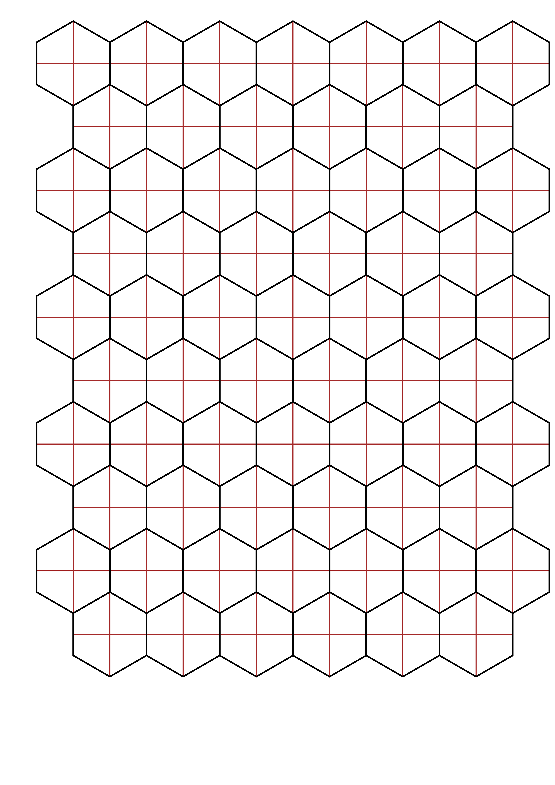

# hexasquare
Hybrid hex/square grid generator

## Example image generation



## TODO
- Generate PDF
- Parse args for execution parameters
- Support non-A4 layouts
- Calculate "size-in-paper" and generate image for given size

## Build
Has been developed with python 3.11. Local runs with be done with Python3's `venv` to grab the dependencies:

### Linux
```bash
python -m venv venv
source venv/bin/
python3 -m pip install -r requirements.txt
```

to open a shell within a local virtual environment and install the needed dependencies in it.

### Windows
```cmd
python -m venv venv

# In cmd.exe
venv\Scripts\activate.bat
# In PowerShell
venv\Scripts\Activate.ps1

python3 -m pip install -r requirements.txt
```

to open a shell within a local virtual environment and install the needed dependencies in it.
